```
{
  "Ocp-Apim-Subscription-Key": "cc8c9c8152f14f169694366847a86d1d",
  "Ocp-Apim-Subscription-Region": "eastus",
  "AzureTranslateURL": "https://eastus.api.cognitive.microsoft.com/translator/text/v3.0/translate",
  "YOUR_DEPLOYMENT_NAME": "gpt-4o-mini",
  "YOUR_RESOURCE_NAME": "https://eastusaiforworkshop.openai.azure.com",
  "api-key": "e3aae9d9a652421687c4cceccc2f91e2",
  "endpoint": "https://aisearchfordemo.search.windows.net",
  "key": "uxw5r9Nvwxdumirxg6f1Xi6xbytxDDwqXvo5Tbcj4CAzSeDqq2kB",
  "indexName": "azureblob-index"
}
```

# ACW-GenAI-UniversalTranslator
In this exercise we are going to walkthrough building a universal translator in C# to take an input in any language and output it in English. We will continue this process with our own documents to use retrieval augmented generation (RAG) to get a printer manual to every language in Azure! This example document is owned and produced by Epson. It just so happens to be a printer I own and have the manual for. You can use this example for any document you have access to just throw it into the example every time you see Epson.

# NOTE
This is a sample project and a basic tier of Azure AI Search does run about $75 per month. So be sure to tear this down after you are done with it. Everything else should be under the free or almost free usage of the rest of the services.

## Pre-requisites
- Install [Azure CLI](https://learn.microsoft.com/en-us/cli/azure/get-started-with-azure-cli?WT.mc_id=AZ-MVP-5005115) If you want to follow the completed solution
- Have an Azure account
- Have access to [Azure OpenAI](https://learn.microsoft.com/en-us/azure/ai-services/openai/overview#how-do-i-get-access-to-azure-openai?WT.mc_id=AZ-MVP-5005115)
- .Net 8.0 (or your rest client/framework of choice)

## Architecture Diagram
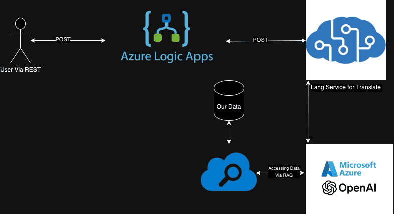

Here is a sample architecture diagram. The challenge section of this will be replacing the logic app section. You can use any rest client or framework you want to use to call our APIs Azure will give us! Knowing that all we can use Azd up to create a resource group, Azure AI Services, Azure OpenAI, and an Azure Storage Account! 

##### Small Challenge
If you want more of a hands on challenge try creating each of these resources yourself by hand, and then manually indexing the data in Azure Search. This will give you a better understanding of how each of these services work and how they can be used in a real world scenario.

##### Flow of data
Talking about the resources from ingress to egress we have our app, next we will call Azure AI Services to identify the language coming in and translating it to English, we then will take that output and send it to Azure OpenAI understand our question and generate a response with our data stored in Azure Search, Azure Search is connected and will have indexed our data stored in our storage account, Azure Open AI's response will go back into Azure AI Services to return it in the language we want, finally sending back the user's request in the language they requested.
## Challenge 1 Infra
If you want to follow along and skip the challenge section you can run the following commands to create the resources needed for this project. 

We are going to run the deploy.sh script. This script will
- Create a resource group
- Create an Azure AI Services resource
- Create an Azure OpenAI resource
- Create an Azure Storage Account
  - Create a container in the storage account called testcontainer
- Create an Azure Search resource

First you want to run az login and confirm you are in the right subscription. Then run the following commands
```bash
./Infra/deploy.sh
```

By the end of this you will now have an Azure AI Services resource, an Azure OpenAI resource, an Azure Storage Account, and an Azure Search resource. Now we will move onto the next step.

## Challenge 2
Now that we have our storage account and AI Search services created we need to create a container in our storage account and upload our document in our documents folder. After that we are going to add it as a data source in our Azure Search service and index the data!

<details><summary>Hint 1 Option 1 File Upload Portal</summary>

  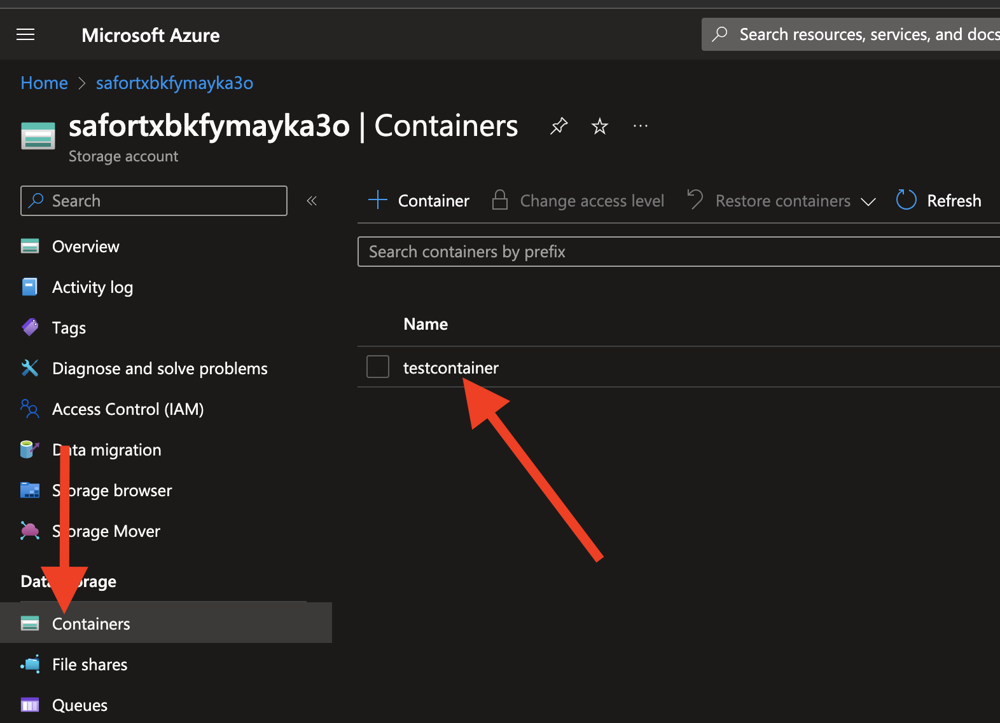
  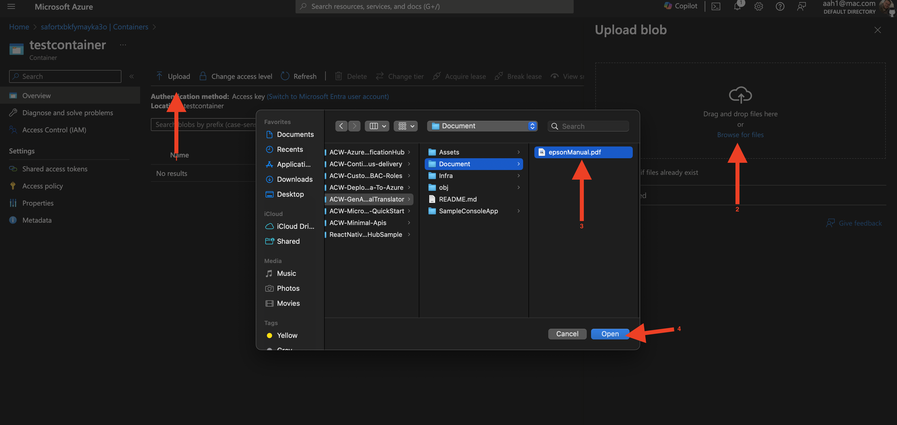
  
</details>

<details><summary>Hint 1 Option 2 File Upload CLI</summary>
Make sure you wap out with your details.

``` shell

    storageAccountKey=$(az storage account keys list --account-name mystorageaccount --query "[0].value" --output tsv)
    az storage blob upload --account-name mystorageaccount --account-key $storageAccountKey --container-name mycontainer --name myblob --type block --file ./Document/epsonManual.pdf --output table
  ```
  
</details>

<details><summary>Hint 2 Add The Data Source to AI Search</summary>

  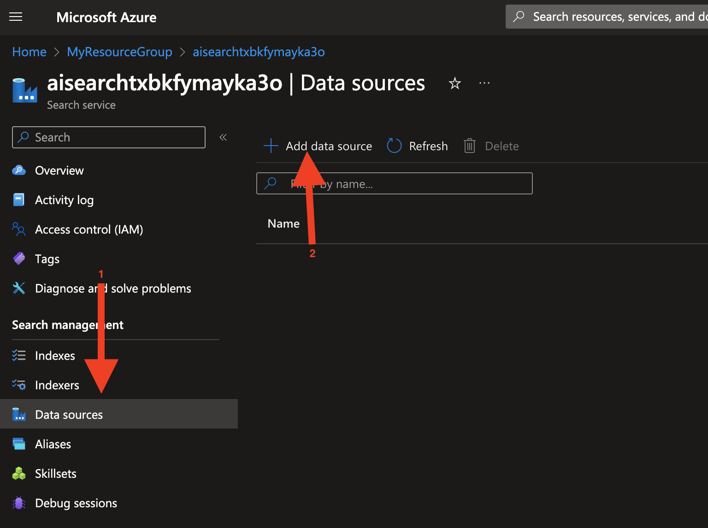
  
  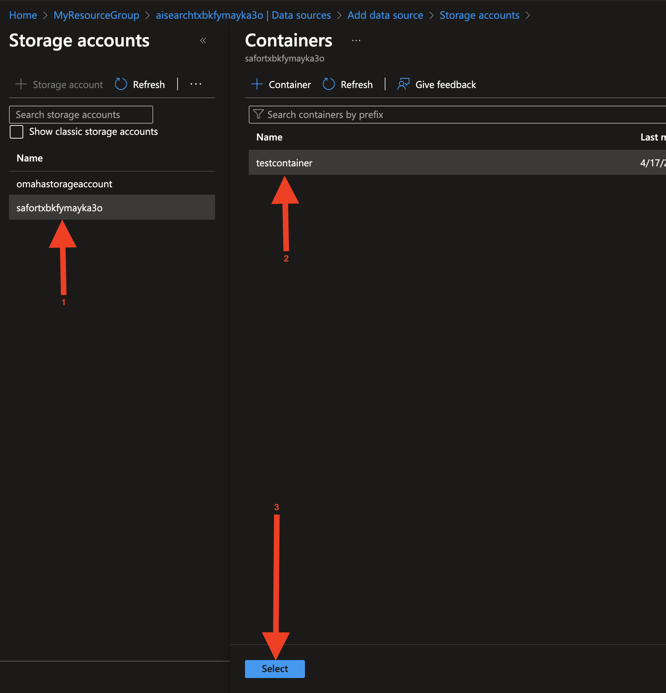

  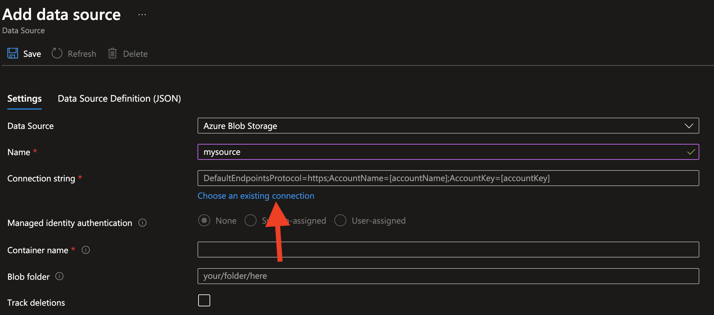
  
  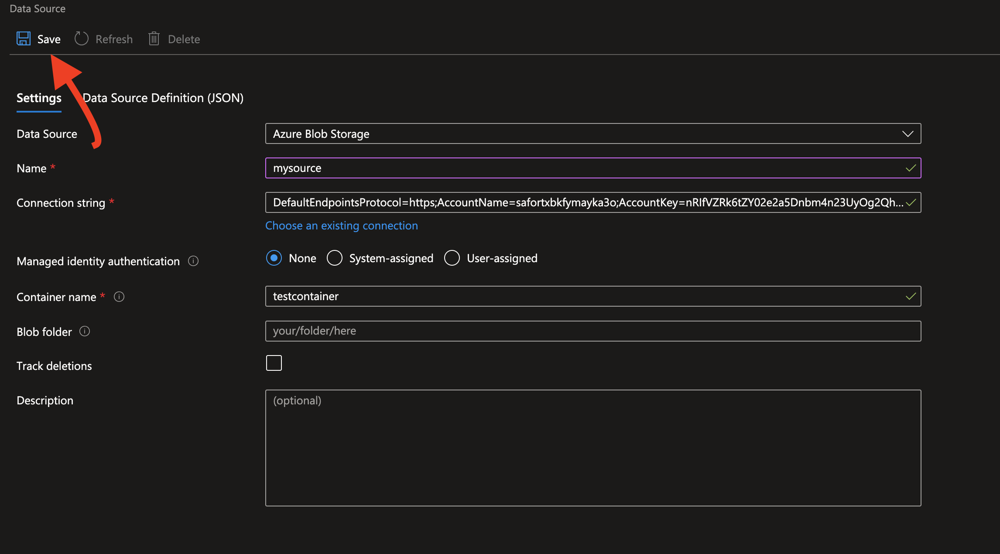


</details>

<details><summary>Hint 3 Index the Data Source</summary>


  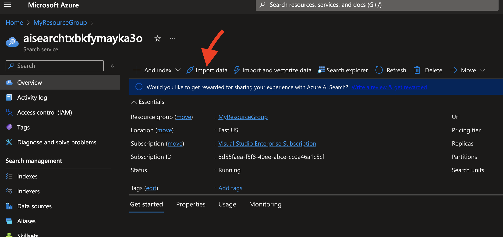
  
  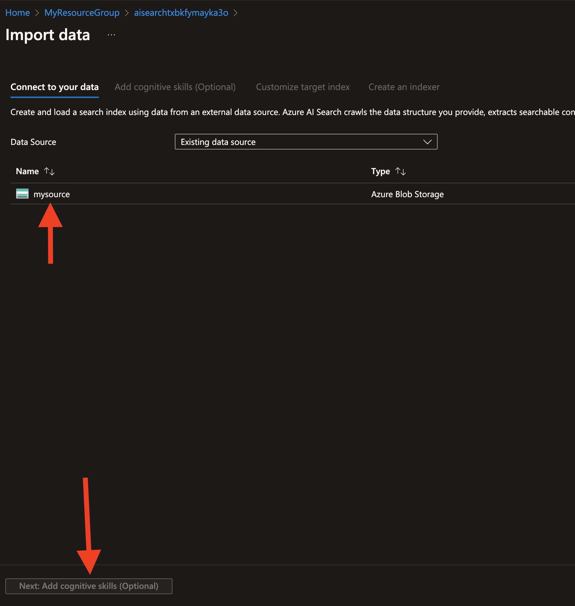

  ### Skip COG Service

  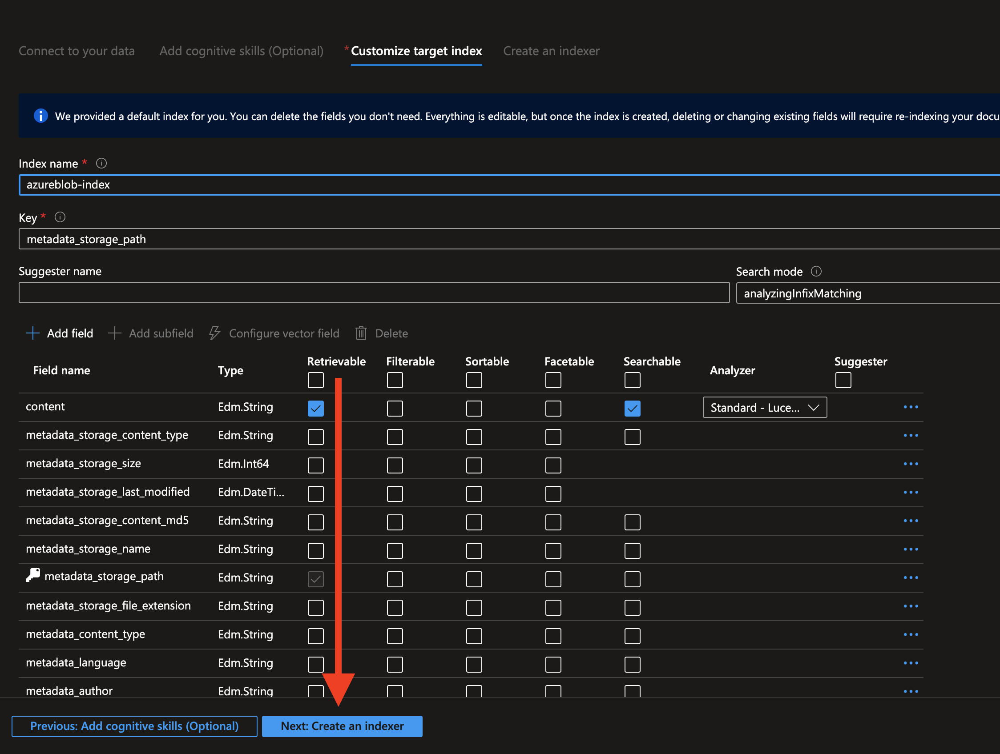
  
  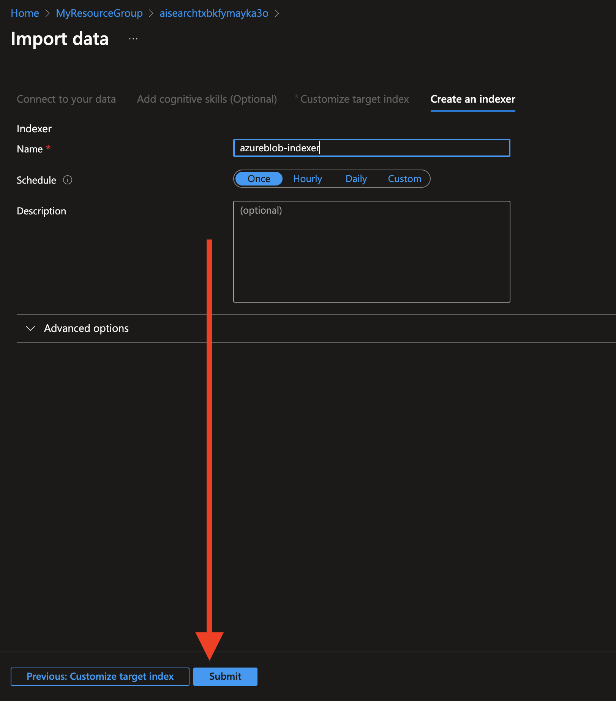

</details>


## Challenge 3
Now that we have our resources created we will need to create a rest client to call our APIs. We will need to call Azure AI Services to identify the language and translate it to English. We will also want to save off the incoming language so we can translate it back later. Get to reading documentation and start coding!

<details><summary>Hint 1 </summary>

  Here is the docs for Azure AI Services specifically the [translate API.](https://learn.microsoft.com/en-us/azure/ai-services/translator/reference/v3-0-reference?WT.mc_id=AZ-MVP-5005115)
</details>

<details><summary>Hint 2</summary>
  URL Doesn't work anymore but good for inspiration use this URL format instead
  <your api url>/translate?api-version=3.0&to=en

  
</details>

<details><summary>Hint 3</summary>
  Example body should look like the following

  ```json
[
    {"Text":"I would really like to drive your car around the block a few times."}
]
```
</details>

If you are still stuck don't worry! Check out FIRST API CALL in SampleConsoleApp/Program.cs in the code folder for a sample implementation.

## Challenge 4
Now we need to make a rest call to our Azure OpenAI service giving it access to our data in Azure Search. We are going to pass the result from Challenge 3 into the content section of our call. 

<details><summary>Hint 1</summary>

  Here is the docs for Azure OpenAI specifically the [extensions API.](https://learn.microsoft.com/en-us/azure/ai-services/openai/reference?WT.mc_id=AZ-MVP-5005115#azure-ai-search)
</details>

If you can't figure it out checkout SECOND API CALL in SampleConsoleApp/Program.cs in the code folder for a sample implementation.

## Challenge 5
Now we should have our data back from our document and we can translate it back from the language we first received. We will need to call Azure AI Services again to translate it back to the language we received in the first call.

<details><summary>Hint 1 </summary>

  Here is the docs for Azure AI Services specifically the [translate API.](https://learn.microsoft.com/en-us/azure/ai-services/translator/reference/v3-0-reference?WT.mc_id=AZ-MVP-5005115)
</details>

<details><summary>Hint 2</summary>

  
</details>

If you are still stuck don't worry! Check out THIRD API CALL in SampleConsoleApp/Program.cs in the code folder for a sample implementation.

## Conclusion
You are now able to build a universal translator to get any language in and back out in your rest client of choice. If you are using my sample app you now have a console app and an example on how you can bring AI into you C# code! 

## Running the Program with a Command Line Argument
The program now accepts a command line argument for the phrase to be translated. If no command line argument is provided, the program will use a default phrase.

### Example Command
```bash
dotnet run --project SampleConsoleApp "Your phrase to be translated"
```

### Default Phrase
If no command line argument is provided, the program will use the default phrase: "Boutons et voyants du panneau de commande\n".

## Running the Program with a Command Line Argument (Javascript Version)
The Javascript version of the program also accepts a command line argument for the phrase to be translated. If no command line argument is provided, the program will use a default phrase.

### Example Command
```bash
node SampleConsoleAppJS/Program.js "Your phrase to be translated"
```

### Default Phrase
If no command line argument is provided, the program will use the default phrase: "Boutons et voyants du panneau de commande\n".
